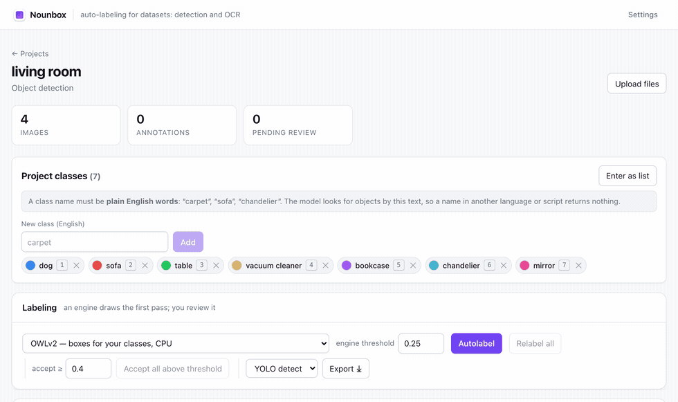
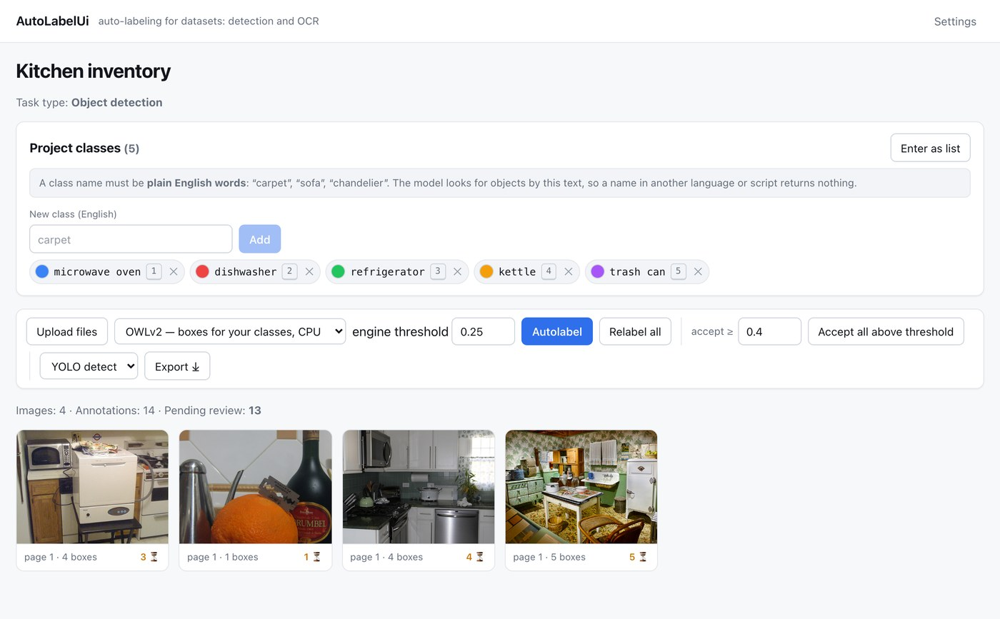
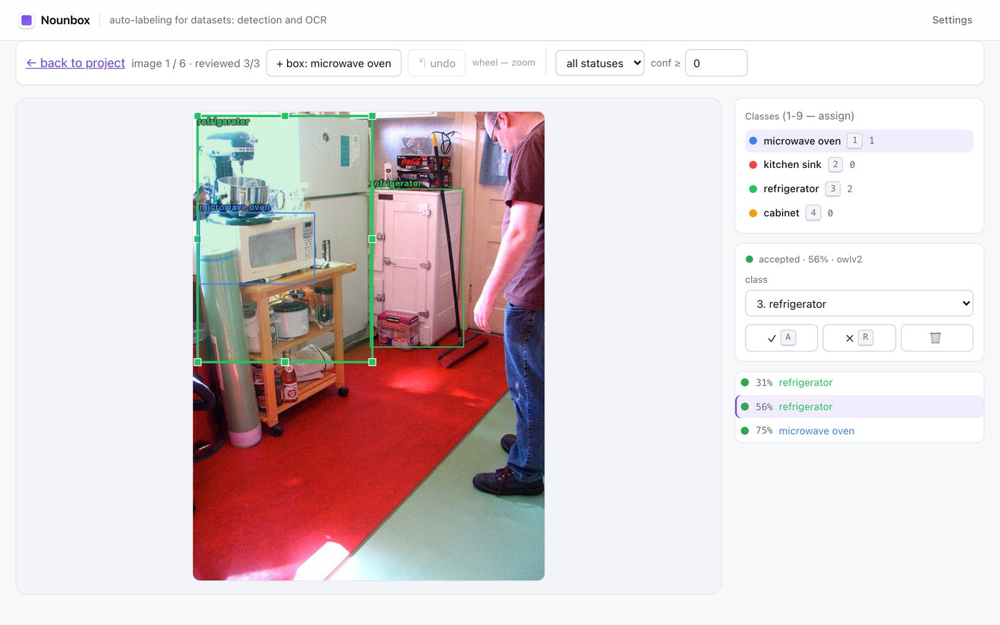
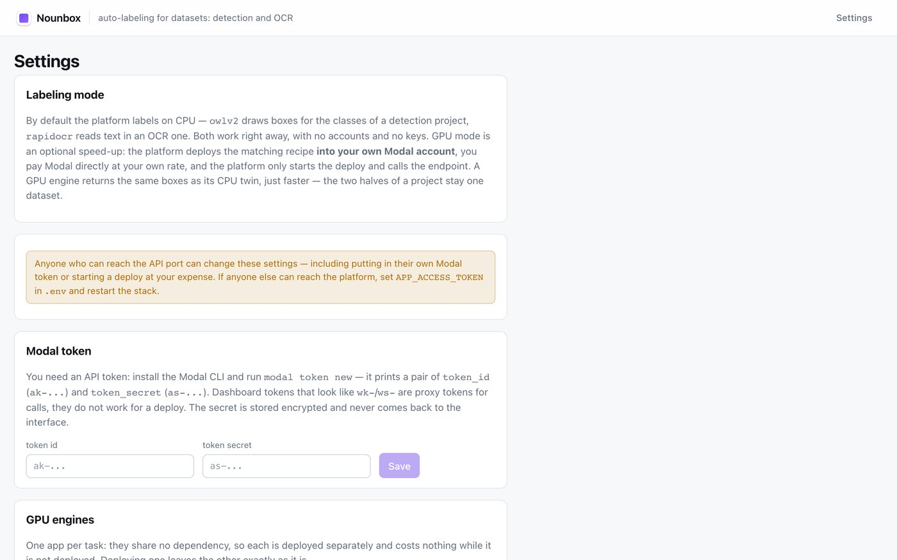

# Nounbox

**Name your classes in plain English. Get boxes. Fix what is wrong. Export.**

Self-hosted auto-labeling for object detection. No accounts, no API keys, no
GPU, and nothing leaves your machine.

[](https://github.com/limitedonlyde/nounbox/actions/workflows/test.yml)
[](LICENSE)
[](https://github.com/limitedonlyde/nounbox/pkgs/container/nounbox-server)



*Five class names, four photos, fourteen boxes — then a human fixes the one that
is off and exports YOLO.*

> **Status: early.** The core loop works end to end and is covered by tests, but
> the API and the database schema still move between releases, there is no
> multi-user support, and migrations are not in place yet. Expect rough edges,
> and pin an image tag if you depend on it.

## Quickstart

```bash
curl -fsSLO https://raw.githubusercontent.com/limitedonlyde/nounbox/main/docker-compose.ghcr.yml
docker compose -f docker-compose.ghcr.yml up -d
```

Open http://localhost:8080, create a project, type the classes you care about,
drop in photos, press **Autolabel**.

Prebuilt images (`linux/amd64` and `linux/arm64`) come from GHCR, so nothing is
compiled on your machine: Docker and roughly 3 GB of disk are all it takes. The
detector weights (~620 MB) download once on the first autolabel run and are
cached in a volume.

> Running your own fork? Point the images at your account with
> `NOUNBOX_OWNER=your-account` in a `.env` beside the compose file.
> `NOUNBOX_TAG=v0.2.0` pins a release; the default, `latest`, tracks `main`.

Everything else is optional. Defaults are the development credentials from
[`.env.example`](.env.example); to change them — or the S3 endpoint, or the VLM
keys — drop a `.env` next to the compose file.

> **Upgrading is not safe yet.** There are no database migrations: the schema is
> created on first start and new columns do not appear on an existing database.
> A version bump can therefore require `docker compose down -v`, which deletes
> your annotations. **Export your dataset before upgrading**, and pin a tag
> (`NOUNBOX_TAG=v0.2.0`) so a `pull` cannot move you unexpectedly. Migrations
> are the next infrastructure item on the [roadmap](ROADMAP.md).

### Build from source instead

```bash
git clone https://github.com/limitedonlyde/nounbox && cd nounbox
cp .env.example .env
docker compose -f docker-compose.yml up -d --build
```

Slower (the backend image is ~1.7 GB and takes minutes to assemble), but it is
the path to take when you patch the server, add a labeler plugin, or want
PaddleOCR compiled in (`WITH_PADDLE=1`). See
[CONTRIBUTING.md](CONTRIBUTING.md) for the hot-reload dev setup.

## What it looks like

**Say what to look for.** Class names are free text, and nothing is trained in
advance — `microwave oven` and `slow cooker` work the same way `person` does.



**Check the machine's work, do not redo it.** The queue serves the least
confident boxes first. Drag a handle to fix geometry, press a digit to change
the class, `A` to accept. The color of a box is its class; the count next to
each class is how many are on this image.



**Bring a GPU only if you want one.** The default engine runs on the CPU. If
your batches get big, paste a Modal token and the platform deploys the GPU
recipe for your task into your own account — you pay Modal directly, and it
scales to zero.



## Why this exists

Every annotation tool assumes you already have a model. This one assumes you do
not: you describe what you are looking for in words, and an open-vocabulary
detector draws the first pass. Your job shrinks from *drawing* thousands of
boxes to *checking* them.

The classes are arbitrary. `microwave oven`, `slow cooker`, `fire hydrant`,
`forklift` — nothing is trained in advance, nothing is fine-tuned, and the model
has no fixed list of categories.

## How it works

**Ingest** — PNG, JPEG, WebP, multi-page TIFF and GIF, HEIC, PDF, ZIP archives.
Everything is normalized, deduplicated by content hash, and blur-scored.

**Label** — [OWLv2](https://huggingface.co/google/owlv2-base-patch16-ensemble)
(Apache-2.0) runs on the CPU and returns one box per object with a real
confidence score. About 2 seconds per photo on a laptop; the weights (~620 MB)
download once.

**Review** — the queue puts the least confident boxes first, because that is
where your attention is worth the most. Drag the handles to fix a box, press a
digit to change its class, `A` to accept, `D` to draw a missing one. Accept
everything above a threshold in one click.

**Export** — YOLO (`data.yaml` plus normalized labels, with a deterministic
train/val split) or COCO instances. Only annotations a human has reviewed are
exported.

## Optional: your own GPU

For large batches, open **Settings**, paste a Modal API token and press
**Connect GPU**. The platform deploys the recipe into *your* Modal account,
secures the endpoint with a generated bearer token, and the matching GPU engine
appears in the engine list. You pay Modal directly for the seconds you use, and
it scales to zero when idle. This is entirely optional — the CPU path is the
default and needs no account at all.

There are **two GPU apps, one per task**, deployed by their own buttons:
`modal_gpu_detect` runs OWLv2 and draws boxes, `modal_gpu` runs PaddleOCR and
reads text. They share no dependency, so each is built and deployed separately,
and deploying one leaves the other exactly as it is. A GPU engine only ever
offers itself to a project whose task its recipe actually serves.

The detection GPU is the same model, the same thresholds and the same
post-processing as the CPU engine — a project labeled half on CPU and half on
GPU is still one dataset, and the benchmark above shows the two paths finding
the same objects. What changes is per-image latency: 2.3 s on an M2 CPU against
a measured 1.35 s on a T4, plus 36 s once for the first photo after an idle
period. Note that a labeling run still goes through the images **one at a
time**, so that is the whole of the speed-up; the extra containers Modal is
allowed to start buy nothing yet.

**You will probably not pay for this.** Modal's Starter plan carries
[$30/month in free credits](https://modal.com/pricing), and a T4 bills at
$0.000164/second — about 50 GPU-hours a month, which at the rate above is on
the order of a hundred thousand photos before the free credits run out. Cold
starts and the idle window eat into that, so treat it as an order of magnitude
rather than a quota. Set a spending limit on the workspace anyway.

**Upgrading an existing installation.** The new engine needs one new table,
which the server creates by itself on the next start — no migration, no manual
SQL. A GPU you had already connected is preserved as the **OCR** GPU and keeps
working without a redeploy; that is what it always was. To get boxes on the GPU
you press **Connect GPU** once more on the detection card.

## Choosing an engine

| Engine | Runs on | Notes |
|---|---|---|
| **OWLv2** | CPU | Default. Predictions do not change when you add a class |
| LLMDet | CPU | Slower, sometimes tighter boxes. Max 91 classes per run |
| GPU boxes (`modal_gpu_detect`) | your Modal account | OWLv2 on a T4. Same F1 as the CPU default (0.824 vs 0.823), 1.35 s/image instead of 2.3 |
| GPU OCR (`modal_gpu`) | your Modal account | PaddleOCR PP-OCRv5. OCR projects only |
| Consensus | CPU | Runs several engines and scores their agreement |
| VLM / HTTP | any endpoint | Bring your own model behind a small convention |

Engines are plugins. A labeler is one method —
`predict(image, config) -> list[Annotation]` — registered as a Python entry
point, and the core never needs to know about it. See [`sdk/`](sdk).

## What it is not good at

Being honest saves you an afternoon:

- **Attributes do not work.** `carpet` is found; `persian carpet` is not. No
  open-vocabulary detector reliably separates a class from its adjective. Detect
  the broad class, then split it downstream.
- **Crowded scenes are harder than single objects.** On our benchmark, F1 drops
  from 0.89 on product-style photos to 0.78 on cluttered rooms.
- **Zero-shot is a first draft, not a finished dataset.** A model fine-tuned on
  your corrected data will beat it on your domain. That is the point: this tool
  gets you to that data faster.
- Boxes only. No masks, no polygons, no keypoints, no video.

## Benchmark

Measured on 79 photos from LVIS val (323 objects, 114 classes) spanning cluttered
scenes, street shots, phone snaps and product-style images. Each image was
prompted with its own classes, IoU 0.5, greedy matching.

| Engine | F1 | Precision | Recall | Sec/image |
|---|---|---|---|---|
| OWLv2 (default) | 0.823 | 0.826 | 0.820 | 2.3 (CPU) |
| OWLv2 on a Modal T4 | 0.824 | 0.828 | 0.820 | 1.35 (GPU, median) |
| LLMDet base | 0.848 | 0.867 | 0.830 | 4.7 (CPU) |

Treat these as a starting point, not a verdict: 323 objects is a small sample,
and LVIS is a friendly benchmark for this family of models. What matters is how
an engine does on *your* photos.

The GPU row is the same 79 photos through the deployed recipe, same prompts and
same 0.25 threshold — it exists to show the two paths agree, not to claim the
GPU is smarter. They found the same 265 objects and missed the same 58. Out of
321 detections exactly one differed: a `coffee table` scoring 0.2502 on the CPU,
two ten-thousandths above the cutoff, which landed just under it on the GPU.
Everything else matched to a fraction of a pixel, with scores drifting by ~0.001
on average — CUDA and CPU kernels reduce in a different order, so the engines
agree to float32 tolerance rather than bit for bit.

Speed is where the GPU actually pays: 1.35 s median per image against 2.3 s on
a laptop CPU, measured one request at a time. Budget 36 s for the first photo
after an idle period — the app scales to zero, so it pays for the container
boot and the ~620 MB of weights, once. Later cold starts are seconds, because
the weights stay in the volume.

Throughput, measured by pushing concurrent requests at the deployed endpoint
until it stopped going faster:

| Containers | Ceiling | Where it saturates |
|---|---|---|
| 4 (the shipped default) | ~296 images/min | 8 concurrent requests |
| 10 (a Starter workspace's limit) | ~682 images/min | 24 concurrent requests |

Both ceilings are just the container count divided by the ~0.85 s an image
actually takes, which is what you want to see — nothing else is in the way.
Past saturation only latency grows.

A labeling run now keeps four images in flight against a remote engine
(`REMOTE_LABELER_CONCURRENCY`), which is what `max_containers=4` in the recipe
is sized for — raise the two together or the extra containers never wake.
Measured end to end through the app, not against the bare endpoint: 79 photos
went from 153 s to 70 s, 31 to 68 images a minute, same 94 annotations either
way. That is short of the endpoint's own 296/min because each image still opens
a fresh TLS connection to Modal; pooling them is the next thing to fix.

Only the platform's own GPU engines are dispatched concurrently. The `vlm` and
`http` engines point wherever you configured them — `vlm`'s default is Ollama on
the same machine as the worker — and four concurrent requests to one local GPU
would split its memory four ways rather than speed anything up.

One finding worth reusing elsewhere: the stock
`post_process_grounded_object_detection` in `transformers` keeps only the
best-scoring class per box, which silently dropped 12% of detections in our runs
by relabeling them with a neighboring class (`kitchen sink` → `sink`,
`table lamp` → `lamp`). Emitting boxes per query instead recovers all of them and
makes predictions independent of how many classes you have.

## Thresholds

Defaults come from the benchmark above:

- **0.25** to show a box to a human (precision 0.83, recall 0.82)
- **0.40** to accept in bulk without looking (precision 0.94)

## Architecture

```
docker-compose.yml    postgres, minio, redis, api, worker, web (built locally)
docker-compose.ghcr.yml  same stack from published images, no build step
sdk/                  labeler plugin contract (pip package)
server/               FastAPI + SQLAlchemy (async) + arq worker
web/                  React + TypeScript review UI
labelers/             engine plugins
deploy/modal/         serverless GPU recipes
```

`api` and `worker` are the same image (`nounbox-server`) started with
different commands — one serves HTTP, the other drains the arq queue — so they
can never drift apart on a shared database.

One annotation model covers detection and OCR alike: geometry, label, text,
attributes, plus provenance — which engine produced it, with what confidence,
and what the human did with it. That last part is what makes quality
measurable instead of anecdotal.

OCR is still supported as a second task type (`Project.task_type`), with
PaddleOCR and VLM engines and PaddleOCR export formats.

## Development

`docker compose up -d --build` (without `-f`) picks up
`docker-compose.override.yml` and swaps in the Vite dev server with hot reload,
`uvicorn --reload` and live-mounted source. See
[CONTRIBUTING.md](CONTRIBUTING.md).

## Security

- Change the default credentials in `.env` before exposing anything.
- Ports bind to `127.0.0.1`. Put a TLS-terminating proxy in front.
- Set `APP_ACCESS_TOKEN` if anyone else can reach the API port: without it, the
  settings endpoints that accept your Modal token and trigger deploys are open.
- Set `S3_PUBLIC_ENDPOINT_URL` when deploying beyond localhost, or image
  previews break — they are presigned URLs opened directly against MinIO.

## Roadmap

See [ROADMAP.md](ROADMAP.md). Box editing landed recently; next up is quality
calibration on your own data, separating the prompt from the class name, and
importing existing COCO/YOLO datasets.

## License

[AGPL-3.0](LICENSE). Run a modified version as a network service and you owe its
source to your users.

Demo photos come from [COCO](https://cocodataset.org) / Flickr under
Creative Commons Attribution licenses — see [docs/DEMO_IMAGES.md](docs/DEMO_IMAGES.md).
