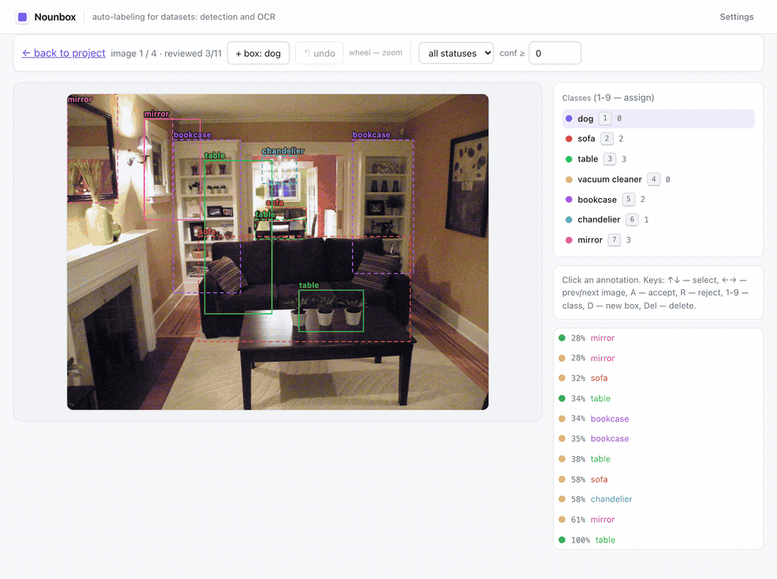

# Nounbox

**Type class names in plain English. Get boxes. Fix what's wrong. Export YOLO or COCO.**

[](https://github.com/limitedonlyde/nounbox/actions/workflows/test.yml)
[](LICENSE)
[](https://github.com/limitedonlyde/nounbox/pkgs/container/nounbox-server)


*Seven class names, four photos, eleven boxes — then a human drags a corner
straight and accepts it with one key.*

Self-hosted auto-labeling for object detection. Nothing is trained in advance and
there is no fixed category list, so `slow cooker` works the same way `person`
does — and your job shrinks from *drawing* thousands of boxes to *checking*
them. Runs on your CPU. No accounts, no API keys, nothing leaves the machine.

## Run it

```bash
curl -fsSL https://raw.githubusercontent.com/limitedonlyde/nounbox/main/docker-compose.ghcr.yml | docker compose -f - up -d
```

Open <http://localhost:8080>, create a project, type the classes you care about,
drop in photos, press **Autolabel**. Prebuilt multi-arch images pull anonymously
from GHCR, so nothing compiles locally — Docker and roughly 3 GB of disk are the
whole requirement. The detector weights (~620 MB) download once on the first
autolabel run and stay in a volume.

To stop it: `docker compose -p nounbox down`.

## Does it work

**F1 0.823** — [OWLv2](https://huggingface.co/google/owlv2-base-patch16-ensemble)
on 79 photos from LVIS val (323 objects, 114 classes), scored against human
ground truth at IoU 0.5. **2.3 s per photo** on an M2 CPU.

Treat that as a starting point, not a verdict: 323 objects is a small sample and
LVIS is a friendly benchmark for this family of models. What matters is how it
does on *your* photos.

Want it faster? Paste a Modal token and Nounbox deploys the same model into
*your* Modal account: 1.35 s per photo, and a labeling run keeping four images
in flight moves at 249 images/min. It is the same boxes, not a smarter model —
F1 0.824 against the CPU's 0.823 on the same 79 photos, verified. Modal's free
tier is $30/month, which at that rate is on the order of a hundred thousand
photos — an order of magnitude, not a quota.

## Reviewing is the job



*The queue serves the least confident boxes first. Drag a corner to fix the
geometry, press a digit to change the class, `A` to accept, `D` to draw one the
engine missed — the keys are the point, since you will do this a few hundred
times.*

## Where it breaks

- **Attributes don't work.** `carpet` is found; `persian carpet` is not. Detect
  the broad class and split it downstream.
- **Crowded scenes are harder than single objects.** On the benchmark above, F1
  falls from 0.89 on product-style photos to 0.78 on cluttered rooms.
- **Zero-shot is a first draft, not a finished dataset.** A model fine-tuned on
  your corrections will beat it on your domain — getting you that data faster is
  the point.
- **Boxes only.** No masks, no keypoints, no video.
- **No migrations yet.** The schema is created on first start, so a version bump
  can require `docker compose down -v`, which deletes your annotations. Export
  your dataset before upgrading. No release is tagged yet, so `latest` is all
  there is — pin `NOUNBOX_TAG` once one exists.

## Build from source instead

```bash
git clone https://github.com/limitedonlyde/nounbox && cd nounbox
cp .env.example .env
docker compose -f docker-compose.yml up -d --build
```

Slower — the backend image is ~1.7 GB — but this is the path when you patch the
server or add an engine. See [CONTRIBUTING.md](CONTRIBUTING.md).

## More

[**Guide**](docs/GUIDE.md) — engines, GPU setup, exports, thresholds,
architecture, security ·
[Roadmap](ROADMAP.md) · [Contributing](CONTRIBUTING.md) · [AGPL-3.0](LICENSE)

Demo photos come from [COCO](https://cocodataset.org) / Flickr under Creative
Commons Attribution licenses — see [docs/DEMO_IMAGES.md](docs/DEMO_IMAGES.md).
